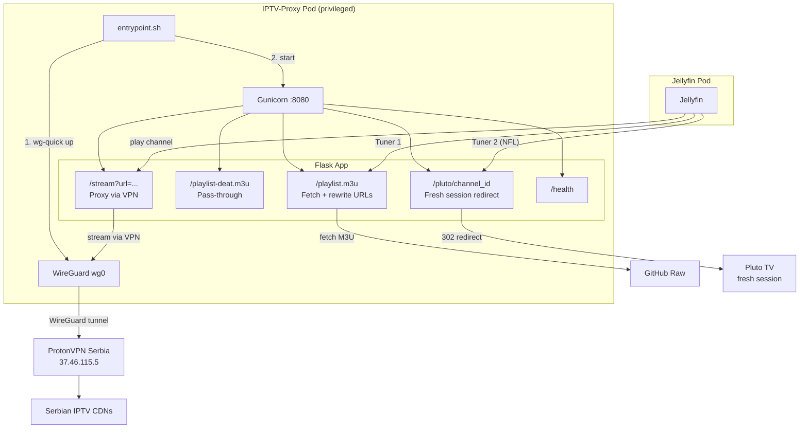
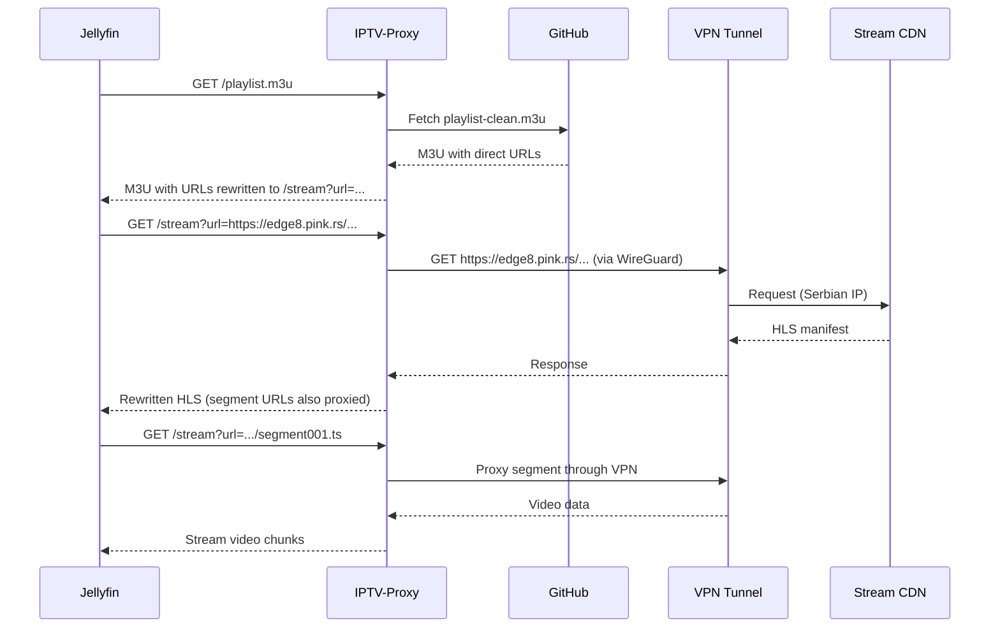

# IPTV-Proxy

Flask-based HTTP proxy that tunnels IPTV streams through a WireGuard VPN (ProtonVPN Serbia). Runs as a privileged Kubernetes pod to manage the VPN interface.

## Architecture



## How it works



## Endpoints

| Endpoint | Method | Description |
|----------|--------|-------------|
| `/health` | GET | Liveness/readiness probe |
| `/playlist.m3u` | GET | Serbian playlist with URLs rewritten through VPN proxy |
| `/playlist-deat.m3u` | GET | DE/AT playlist passed through from GitHub (no VPN) |
| `/stream?url=<encoded>` | GET | Proxy any URL through VPN tunnel with HLS rewriting |
| `/pluto/<channel_id>` | GET | 302 redirect to Pluto TV with fresh session params |

## Files

| File | Description |
|------|-------------|
| `app.py` | Flask application with proxy logic and HLS URL rewriting |
| `Dockerfile` | Container image (python:3.12-slim + wireguard-tools) |
| `entrypoint.sh` | Starts WireGuard, sets DNS, launches Gunicorn |
| `requirements.txt` | Python deps: flask, gunicorn, requests |
| `wg0.conf` | WireGuard config (mounted from K8s secret) |
| `k8s/deployment.yaml` | Kubernetes deployment (privileged, 1 replica) |
| `k8s/service.yaml` | NodePort service on port 8080 |

## Playlists

Playlists are hosted at [Petar-Jorgic/iptv-playlists](https://github.com/Petar-Jorgic/iptv-playlists):

| Playlist | Channels | VPN | Content |
|----------|----------|-----|---------|
| `playlist-clean.m3u` | 16 | Serbia | Serbian TV, Music, News, Religious |
| `playlist-deat.m3u` | 30 | No | German, Austrian, American Football |

## Deployment

```bash
# Build image
buildah bud --no-cache -t iptv-proxy:latest .

# Export and import to k3s
buildah push iptv-proxy:latest docker-archive:/tmp/iptv-proxy.tar:docker.io/library/iptv-proxy:latest
k3s ctr images import /tmp/iptv-proxy.tar

# Deploy
kubectl apply -f k8s/deployment.yaml -f k8s/service.yaml

# Restart after image update
kubectl rollout restart deployment/iptv-proxy
```

## Resources

| | Requests | Limits |
|---|----------|--------|
| CPU | 100m | 500m |
| Memory | 128Mi | 256Mi |
